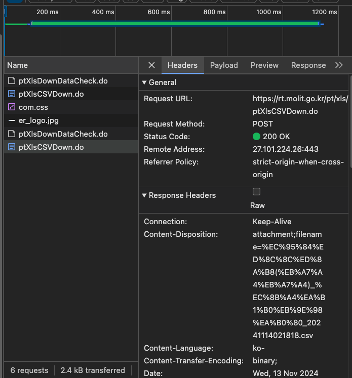
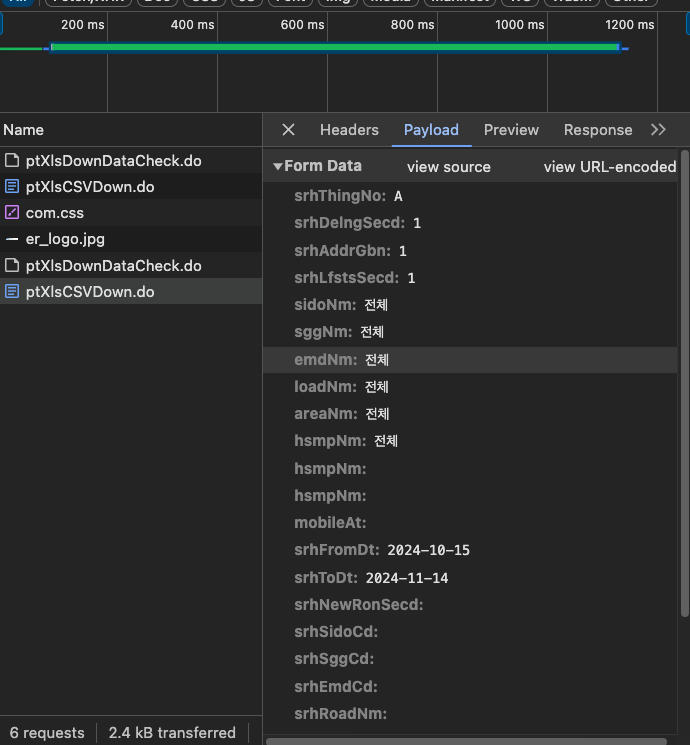
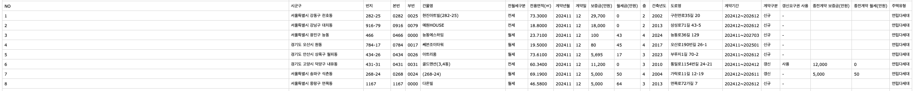

# JungJong 부통산 프로젝트
- FE - 육종호
- BE - 손정찬

--- 
### 목차
 - [1. 프로젝트 소개](#프로젝트_소개)
 - [2. 프론트엔드](#Frontend)
 - [3. 백엔드](#Backend)
   - [3.1. 공공 API 자료](#API)
     - [3.1.1 아파트 매매 실거래가 자료](#국토교통부_아파트_매매_실거래가_상세_자료_(24.08.23))
     - [3.1.2 아파트 전월세 실거래가 자료]()
     - [3.1.3 단독/다가구 매매 실거래가 자료]()
     - [3.1.4 단독/다가구 전월세 실거래가 자료]()
   - [3.2. 백엔드 API](#벡엔드-API)
     - [3.2.1 회원 도메인](#회원_도메인)
     - [3.2.2 아파트 도메인](#아파트_도메인_[Required_Access_Token])
     - [3.2.3 단독/다가구 도메인](#단독/다가구_도메인_[Required_Access_Token])
     - [3.2.4 지도 도메인](#지도-도메인-[Required-Access-Token]-*)
     - [3.2.5 AI 도메인](#AI-도메인-[Required-Access-Token])
     - [3.2.6 요청/응답 구조](#요청/응답-구조)
--- 
# 프로젝트 소개
...

--- 
# 프론트엔드
...  

---
# 백엔드


# API
## 국토교통부_아파트 매매 실거래가 상세 자료 (24.08.23)
https://www.data.go.kr/data/15126468/openapi.do#/API%20%EB%AA%A9%EB%A1%9D/getRTMSDataSvcAptTradeDev

### Request Params
- LAWD_CD
    - 법종동코드 10자리 중 5자리
- DEAL_YMD
    - 계약년월 6자리
- serviceKey
    - 인증키
- pageNo
    - 페이지 번호
- numOfRows
    - 한 페이지 결과 수

### Reponse
```json
{
  "header": {
    "resultCode": "string",
    "resultMsg": "string"
  },
  "body": {
    "items": {
      "item": {
        "sggCd": "string",
        "umdCd": "string",
        "landCd": "string",
        "bonbun": "string",
        "bubun": "string",
        "roadNm": "string",
        "roadNmSggCd": "string",
        "roadNmCd": "string",
        "roadNmSeq": "string",
        "roadNmbCd": "string",
        "roadNmBonbun": "string",
        "roadNmBubun": "string",
        "umdNm": "string",
        "aptNm": "string",
        "jibun": "string",
        "excluUseAr": "string",
        "dealYear": "string",
        "dealMonth": "string",
        "dealDay": "string",
        "dealAmount": "string",
        "floor": "string",
        "buildYear": "string",
        "aptSeq": "string",
        "cdealType": "string",
        "cdealDay": "string",
        "dealingGbn": "string",
        "estateAgentSggNm": "string",
        "rgstDate": "string",
        "aptDong": "string",
        "slerGbn": "string",
        "buyerGbn": "string",
        "landLeaseholdGbn": "string"
      }
    },
    "numOfRows": 0,
    "pageNo": 0,
    "totalCount": 0
  }
}
```

## 국토교통부_아파트 전월세 실거래가 자료 (24.08.23)
### Request
- LAWD_CD
    - 법정동 앞 5자리
- DEAL_YMD
    - 계약년월 6자리
- serviceKey
    - 인증키
### Response#id1 
```json
{
  "header": {
    "resultCode": "string",
    "resultMsg": "string"
  },
  "body": {
    "items": {
      "item": {
        "sggCd": "string",
        "umdNm": "string",
        "aptNm": "string",
        "jibun": "string",
        "excluUseAr": "string",
        "dealYear": "string",
        "dealMonth": "string",
        "dealDay": "string",
        "deposit": "string",
        "monthlyRent": "string",
        "floor": "string",
        "buildYear": "string",
        "contractTerm": "string",
        "contractType": "string",
        "useRRRight": "string",
        "preDeposit": "string",
        "preMonthlyRent": "string"
      }
    },
    "totalCount": 0,
    "numOfRows": 0,
    "pageNo": 0
  }
}
```
## 국토교통부_단독/다가구 매매 실거래가 자료
### Request
- LAWD_CD
    - 법정동 앞 5자리
- DEAL_YMD
    - 계약년월
- serviceKey
    - 인증키
### Response
```json
{
  "header": {
    "resultCode": "string",
    "resultMsg": "string"
  },
  "body": {
    "items": {
      "item": {
        "sggCd": "string",
        "umdNm": "string",
        "houseType": "string",
        "jibun": "string",
        "totalFloorAr": "string",
        "plottageAr": "string",
        "dealYear": "string",
        "dealMonth": "string",
        "dealDay": "string",
        "dealAmount": "string",
        "buildYear": "string",
        "cdealType": "string",
        "cdealDay": "string",
        "dealingGbn": "string",
        "estateAgentSggNm": "string",
        "slerGbn": "string",
        "buyerGbn": "string"
      }
    },
    "totalCount": 0,
    "numOfRows": 0,
    "pageNo": 0
  }
}
```

## 국토교통부_단독/다가구 전월세 실거래가 자료
- LAWD_CD
    - 법정동 5자리
- DEAL_YMD
    - 계약 년월
- serviceKey
    - 인증키
# 백엔드 API
## 회원 도메인
### 로그인
- 네이버 소셜 로그인
    - [POST] /api/login/naver -> Tokens [HTTP 200]
### 회원가입
- 네이버 소셜 가입
    - [POST] /api/signup/naver -> Tokens [HTTP 201] ( 바로 Token 줄지, 성공 응답만 줄지 정하기)
### 회원 [Required Access Token]
- 유저 조회
    - [GET] /api/user -> User [HTTP 200]
- 유저 정보 수정
    - [PUT] /api/User -> [HTTP 200 OR 204]
    - [FETCH] /Api/User -> [HTTP 200 OR 204]
### 찜 [Required Access Token]
- 건물 찜하기
    - [POST] /api/favorite ->  [HTTP 201]
- 건물 찜한것들 조회
    - [GET] /api/favoite/list -> [HTTP 200]
        - 페이지네이션 ? -> offset, limit 추가하기
### 토큰
- Access Token 재발급 [Required Refresh Token]
    - [POST] /api/reissue -> [HTTP 200]  /  [HTTP 401 | 403]
## 아파트 도메인 [Required Access Token]
### 상세 정보
- 아파트 상세 정보 조회
    - [GET] /api/apt -> [HTTP 200]
## 단독/다가구 도메인 [Required Access Token]
### 상세 정보
- 아파트 상세 정보 조회
    - [GET] /api/single -> [HTTP 200]
## 지도 도메인 [Required Access Token] *


## AI 도메인 [Required Access Token]
### AI 평가 및 점수
- AI 평가 및 점수 요청
    - [POST] /api/ai/review -> [HTTP 200]

## 요청/응답 구조
### 요청
- 로그인 / 회원가입 제외하고는 항상 AccessToken을 헤더에 담아서 ...!
- AccessToken 만료 -> (성공 : [HTTP 200]) | (실패 : [HTTP 401] )
    - [HTTP 401] 받으면 Refresh Token으로 재발급
    - Refresh Token 도 [HTTP 401] OR [HTTP 403] 이면, 재로그인 시키기
    - (참고) 각 인가코드 및 인가상태코드는 1회용임,,, 재사용 불가능...!
### 응답
1. 구조 1
   ```json
   {
	   status: "success" | "fail" | HttpStatus,
	   massge: "데이터가 없습니다." | "성공" | "중복" 등...,
	   data: {
		   id: 1,
		   content: ~~,
		   ...
	   }
   }
   
   ```
2. 구조 2 (페이지네이션 추가할 경우)
   ```json
   {
	   status: "success" | "fail" | HttpStatus,
	   massge: "데이터가 없습니다." | "성공" | "중복" 등...,
	   data: {
		   id: 1,
		   content: ~~,
		   ...
	   },
	   pagenation : {
		   page: 0 | 1,
		   size: 10,
		   total: 10000,
		   totalPage: 1000,
		   isFirst: true,
		   isLast: false,
		   
		   (hasNext: true,) 
		   (hasprev: true )
	   }
   }
	```
3. 구조 3 (혹은 이렇게도 가능 편한걸루...)
```json
 {
   respons: {
	   status: "success" | "fail" | HttpStatus,
	   massge: "데이터가 없습니다." | "성공" | "중복" 등...,
	   data: {
		   id: 1,
		   content: ~~,
		   ...
	   }
   },
   pagenation : {
	   page: 0 | 1,
	   size: 10,
	   total: 10000,
	   totalPage: 1000,
	   isFirst: true,
	   isLast: false,
	   
	   (hasNext: true,) 
	   (hasprev: true )
   }
}
```

# 추가 사항
- Kotlin 써도 되는지?
- 익명 의견 or 댓글 기능은 어떨까?


# 11월 14일 추가
한달 단위로 아파트 실거래가를 csv 파일로 조회 가능.
- https://rt.molit.go.kr/pt/xls/xls.do?mobileAt=
- 계약일 기준
- 전국구 데이터는 최근 한달까지만 조회가능.....................
## API로 csv 조회



```
URL : [POST] https://rt.molit.go.kr/pt/xls/ptXlsCSVDown.do?
BODY : [form-data] {
	srhThingNo: A
    srhDelngSecd: 1
    srhAddrGbn: 1
    srhLfstsSecd: 1
    sidoNm: 전체
    sggNm: 전체
    emdNm: 전체
    loadNm: 전체
    areaNm: 전체
    hsmpNm: 전체
    hsmpNm:
    hsmpNm:
    mobileAt:
    srhFromDt: 2024-10-15
    srhToDt: 2024-11-14
    srhNewRonSecd:
    srhSidoCd:
    srhSggCd:
    srhEmdCd:
    srhRoadNm:
    srhLoadCd:
    srhHsmpCd:
    srhArea:
    srhFromAmount:
    srhToAmount:
}
```
## 아파트 매매 실거래가
ex)
```
NO : 1 
시군구 : 광주광역시 동구 소태동
번지 : 443
본번 : 0443
부번 : 0000
단지명 : 진아하이빌
전용면적 : 83.3199
계약년월 : 202411
계약일 : 12
거래금액 : 20,000 만원
동 : -
층 : 4
매수자 : 개인
매도자 : 개인
건축년도 : 2003
도로명 : 학소로 42번길 12
해제사유발생일 : 20241112 
거래유형 : 중개거래
중개사소재지 : 광주 북구
```
- 2024년 1개월 간 아파트 매매 데이터 수 = 약 23000 계약
  - 대략 1년간 계약 수 = 23000 * 12 = 276,000 계약
  - 대략 10년간 계약 수 = 23000* 12 * 10 = 2,760,000 계약
  - 2,760,000 게약의 경우, Full Table Scan 시 약 4초~6초 정도 예상
## 아파트 전월세 실거래가
ex)
```
No : 1
시군구 : 경기도 수원시 영동구 영동동
번지 : 948-4
본번 : 0948
부번 : 0004
단지명 : 영통센트럴파크뷰
전월세구분 : 월세 | 월세
전용면적 : 49.7600 (m^2)
계약년월 : 202411
계약일 : 12
보증금 : 1,886(만원)
월세금(만원) : 100
층 : 6
건축년도 : 1999
도로명 : 영통로514번길 53
계약기간 : 202412~202612
게약구분 : 신규
갱신요구권 사용 : - | 사용
종전계약 보증금(만원) : 65,000
종전계약 월세(만원) : 65
주택유형 : 아파트
```
- 2024년 10~11월 1개월간 아파ㅡ트 전월세 데이터 수 = 약 55,310 계약
- 1년 간 계약수 = 55,310 * 12 = 663,720 계약
- 10년 간 계약수 = 55,310 * 12 * 10 = 6,637,200 계약수
- ->  full talbe scan 시 약 12~15초 예상

## 연립 다세대 매매
```
no
시군구
번지
본번
부번
건물명
전용면적
대지권면적
계약년월
계약일
거래금액(만원)
층
매수자
매도자
건축년도
도로명
해제사유발생일
거래유형
중개사소재지
등기일자
```
- 1개월 계약수 = 4,443
- 10년 = 약 4,443 * 12 * 10 = 533,160 (1초 예상)
## 연립다세대 전월세


- 24년 10~11 월 1개월간 데이터 수 = 11,265 계약
- 10년간 계약 수 = 11,265 * 12 * 10 = 1,351,800 (2~3초 정도 예상)

# 쿼리 성능을 어떻게 올려야할까
- Full Tabe 조회는 성능이 너무 낮음
- -> Index Search 기법
- -> 샤딩
- -> 인메모리 캐시
# 구 단위로 데이터 수집
- 공공 API 의 데이터 조회 = 월 1천 회수로 제한
- 전국의 구 개수 = 35개
- 대한민국 전체 구의 1년동안의 매매현황 조회 시 35 * 12 = 약 420 번 조회해야 함.

# 참고할 만한 부동산 서비스
https://asil.kr/asil/index.jsp
